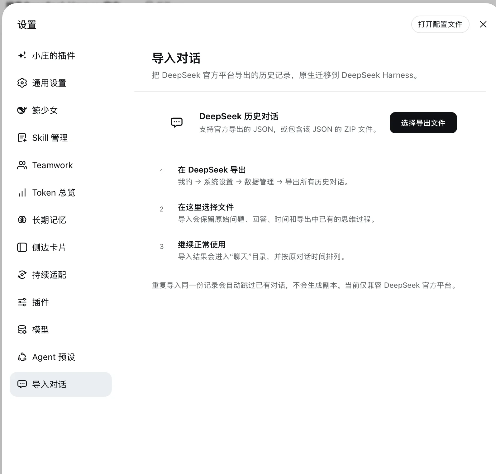
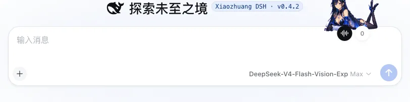

# dsh-chat-migration

English | [中文](README.md)

 

This bundle repository provides two native plugins that can be installed, switched, and exported independently. **Chat mode** enables direct conversation without a bound workspace or local execution access. **Import conversations** migrates history exported by the official DeepSeek service into DeepSeek Harness. Original titles, chronological order, prompts, answers, and exported reasoning are mapped into native chat records.

Current master ships complete native plugin folders and preserves each Settings entry's original plugin-owned icon. Remove its folder to uninstall the capability. See [INSTALL.md](INSTALL.md) for shared compatibility patches and installation checks.

The shared history reader supports Safari desktop windows' native JSON representation, preventing valid Agent answers and tool results from being rejected before display. Installation checks must open old answers, expand tool results, and load earlier records in the user's actual browser; titles or a Chrome-only check do not prove complete history.

## Install

1. Use GitHub **Code → Download ZIP** to download this repository.
2. Give the ZIP to an AI that can read and modify the target DSH project.
3. Tell the AI: **Read AGENTS.md, INSTALL.md, and manifest.json first. Install only this plugin and preserve existing plugins, data, conversations, attachments, and settings.**
4. Enable **Chat mode** and **Import conversations** separately under **Settings → Xiaozhuang plugins**. If only one is needed, the installing AI can install just that entry from `manifest.json`.

## Use

1. In the official DeepSeek app, open **Me → System settings → Data management → Export all conversation history**.
2. In DSH, open **Settings → Import conversations** and select the exported JSON or ZIP.
3. Wait for parsing, then search and select the exact conversation windows to migrate. New records are selected by default; previously imported records are clearly marked and cannot create duplicates.
4. Confirm the import. Imported records appear under Chats in their original chronology. Re-importing the same export skips conversations that already exist.

## Contents

- <code>payload/chat-mode/</code>: generated Chat mode and its direct runtime dependencies from the main repository.
- <code>payload/conversation-import/</code>: generated DeepSeek importer and its direct runtime dependencies from the main repository.
- <code>manifest.json</code>: two independent plugins, their Cordis rows, the source commit, and per-file SHA-256.
- <code>INSTALL.md</code>: direct installation, conflict adaptation, failure recovery, and narrow verification.
- <code>docs/</code>: real product screenshots from this version.

This repository never contains a user's DeepSeek export, conversation history, account, credentials, or local settings.

## Source and license

This repository is a one-way distribution mirror of [Xiaozhuang DSH](https://github.com/niushuanan/xiaozhuang-dsh), not an independent development source. It is synchronized from main-repository commit [`bb949c3d29`](https://github.com/niushuanan/xiaozhuang-dsh/commit/bb949c3d291ea55d378cc5fdb1b237b4f63127b6). Licensed under the [MIT License](LICENSE).
